# 微信小程序使用“IconFont”
作为在前端奋斗的“高富帅”~~没错，说的就是我~~，一定经常使用IconFont来代替图片实现图标的功能，如果你还在用图片那只能说你有点跟不上时代了，那么何为IconFont？把ta拆开来看，就是 Icon 和 Font，这样估计大家应该都能理解是什么，那两者结合是什么呢？没错！就是IconFont！你别问我什么Icon什么Font，脑子是个好东西希望你也有。
本人在撸页面的时候，[Font Awesome](http://fontawesome.dashgame.com/)是必不可少，海量的图标素材几乎不能愁，有时候特殊情况，在Font Awesome上没有自己想要的图标怎么办，请看这里[阿里妈妈MUX](http://www.iconfont.cn/)，同样拥有海量的素材可供使用，而且可以自己定义，看中的图标就丢进购物车，具体有些什么功能，各位自己去摸索吧。
## 什么是图标？
看图不多BB，自行理解。


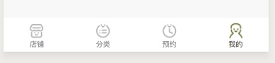

## 什么是IconFont？
嗯，准确点说就是我们平时用的字体，然而ta不再是我们传统认知的“文字”，而是一个个可耐的小图标，看图还是不多BB。

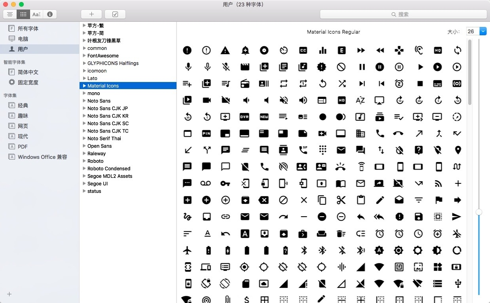

## 重点：如何在微信小程序里面使用

#### 新建属于自己的icon项目

讲了那么多废话，直入主题吧，小程序里面是不能直接引入字体文件的，微信只给了2M的空间供开发使用，所以我们将那些能往外丢的都往外丢，打开[Font Awesome](http://netdna.bootstrapcdn.com/font-awesome/4.7.0/css/font-awesome.min.css) 的引入文件，里面其实就是CSS，既然是CSS那就好办，虽然小程序的样式文件是WXSS，但是语法几乎与CSS一致，你可以理解为就是一模一样。那么就容易很多了，我们直接copy到小程序的.wxss不就好了，嗯，没错，这是关键点之一，但是font文件都不存在如何引入呢？
长话短说，打开[阿里妈妈MUX](http://www.iconfont.cn/)注册一个账号，打开图标管理，里面有你自己的操作历史。
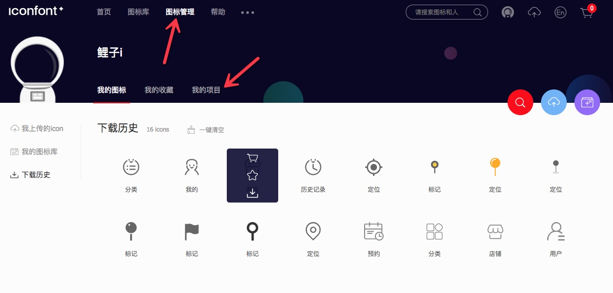

选择“我的项目”，如果没有项目，可以自己新建一个项目，用于区分图标便于管理

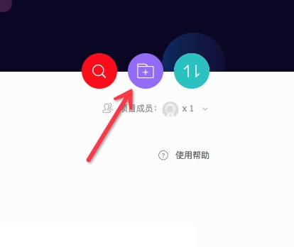

重点在红圈，前缀跟字体名，这里自己可以填写没有规定，尽可能的简便吧，因为我习惯了用Font Awesome，所以我前缀都是填"fa"，字体名也是填"fa"，那么他们具体的意义何在呢，打开项目里面生成的CSS链接：
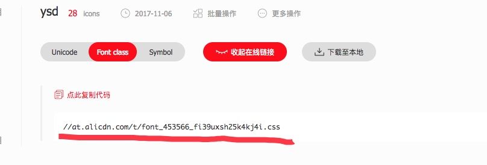


``` css
/*字体名就是这儿，跟你自己填的要一致*/
.fa{
    font-family: "fa" !important;
}
```
``` html
<!--Font Awesome在HTML调用的时候demo结构-->
<i class="fa fa-dingwei"></i>
```
`fa-dingwei`就是你项目图标名
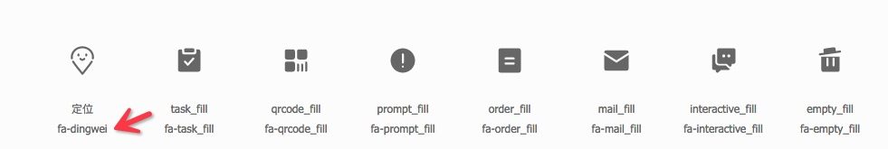
基本的使用就是这样了，下面讲在小程序里优雅的使用！

## 挑选IconFont

##### 将自己需要的icon添加到项目

1. 选好自己要用到的图标添加购物车，然后加入项目
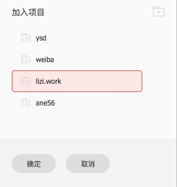
2. 生成css链接

3. 打开css链接复制css
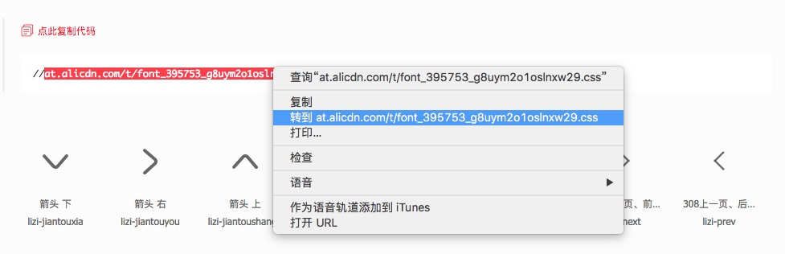
4. 打开小程序开发者工具，在自己项目里面新建一个"font.wxss"的文件
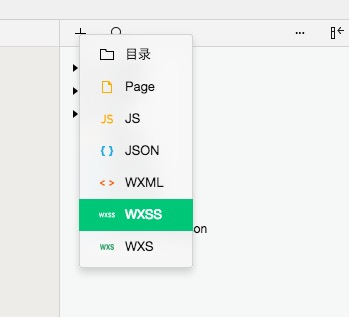
5. 将css复制到font.wxss里面
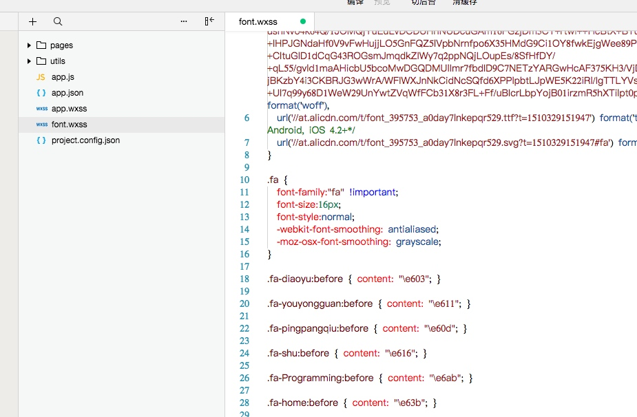
6. 将font.wxss文件引入到index.wxss

``` css
/*引入font.wxss文件，使用绝对路径，避免路径错误引入失败  */
@import "../../font.wxss";
```

7. 在wxml文件使用icon样式

``` html
<!--请注意，这里的类名一定是跟自己定义的统一-->
<view class="fa fa-diaoyu"></view>
```

8. 刷新开发者工具，就能看到<i class="fa fa-diaoyu"></i>，是不是很简单，赶快动手写个试试~

-------

## 分享几个开发中实用的小技巧

#### 小程序的tabBar图标

Tip：

1. 当设置 position 为 top 时，将不会显示 icon
2. tabBar 中的 list 是一个数组，只能配置最少2个、最多5个 tab，tab 按数组的顺序排序。
3. 图片路径，icon 大小限制为40kb，建议尺寸为 81px * 81px，当 postion 为 top 时，此参数无效

**我们把IconFont上面的图标下载到自己的电脑，然后用Photoshop修改大小/颜色，尺寸我们选择81px，选择PNG格式图片，颜色自己自定**
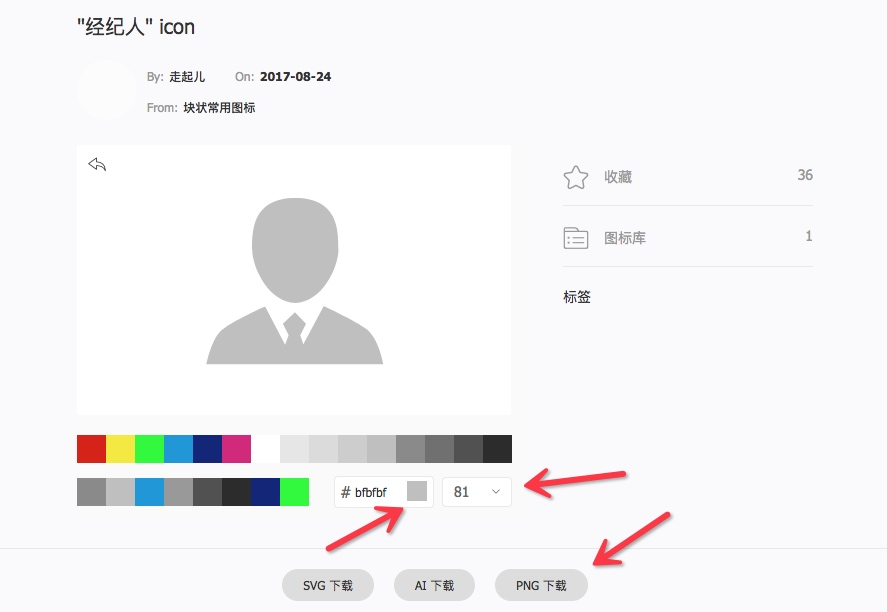
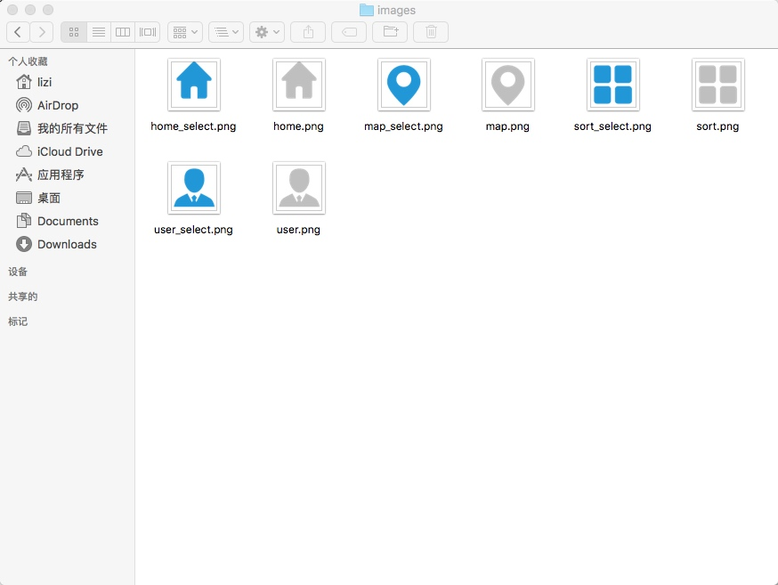
注意了，如果就这样添加到tabBar的Path里面，你会发现图标似乎有点大，效果不是很理想，但是把图片缩小了又变模糊了，那么我们就用Photoshop修改图片里面图标的大小。。
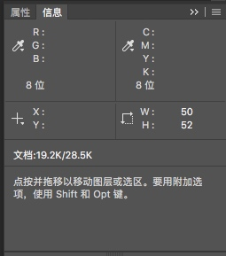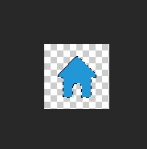
修改图层宽度为50PX，然后居中对齐，其它的都依次修改保存，然后配置小程序的App.json文件

``` json
"tabBar": {
    "color": "#bfbfbf",
    "selectedColor": "#1296db",
    "borderStyle": "white",
    "backgroundColor": "#ffffff",
    "list": [
      {
        "pagePath": "pages/index/index",
        "text": "首页",
        "iconPath": "images/home.png",
        "selectedIconPath": "images/home_select.png"
      },
      {
        "pagePath": "pages/index/index",
        "text": "分类",
        "iconPath": "images/sort.png",
        "selectedIconPath": "images/sort_select.png"
      },
      {
        "pagePath": "pages/index/index",
        "text": "地图",
        "iconPath": "images/map.png",
        "selectedIconPath": "images/map_select.png"
      },
      {
        "pagePath": "pages/index/index",
        "text": "我的",
        "iconPath": "images/user.png",
        "selectedIconPath": "images/user.png"
      }
    ]
  }
```
效果图如下：
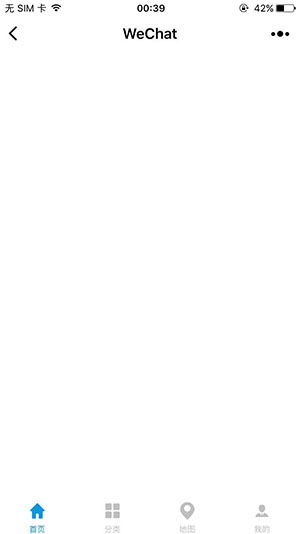 

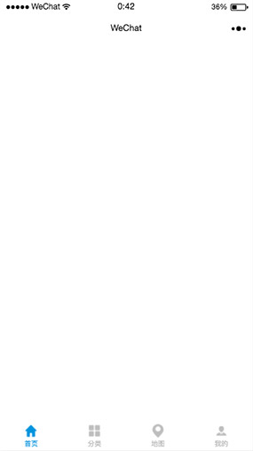 


 
#### 常见的icon应用

##### 菜单按钮

通常像这种有规律性的布局，要么就复制demo结构，要么就用for循环来输出，我这效果用了三种常见的方法来实现，具体效果请看demo文件运行查看

``` css
/*wxss样式表*/
.title{
  padding: 20rpx;
}
.menu-demo{
  width: 100%;
  height: 120rpx;
  background: #fff;
  display: flex;
  color: #333;
}
.menu-item{
  width: 20%;
  height: 100%;
  display: flex;
  flex-flow: column;
  align-items: center;
  justify-content: center;
}
```

1. 不循环，复制粘贴

``` html
<view class='title'>菜单按钮</view>
<view class='menu-demo'>
  <view class='menu-item'>
    <view class='fa fa-home'></view>
    <text>首页</text>
  </view>
  <view class='menu-item'>
    <view class='fa fa-fenlei'></view>
    <text>分类</text>
  </view>
  <view class='menu-item'>
    <view class='fa fa-youjian'></view>
    <text>消息</text>
  </view>
  <view class='menu-item'>
    <view class='fa fa-dingwei'></view>
    <text>地图</text>
  </view>
  <view class='menu-item'>
    <view class='fa fa-jingjiren'></view>
    <text>我的</text>
  </view>
</view>
```

2. JS数组循环

``` html
<view class='title'>菜单栏（JS数组循环）</view>
<view class='menu-demo'>
  <view class='menu-item' wx:for="{{menu}}" wx:key="menu">
    <view class='fa {{item.icon}}'></view>
    <text>{{item.text}}</text>
  </view>
</view> 
```

``` javascript
Page({
  data: {
    menu: [
      { 'icon': 'fa-home', 'text': '首页' },
      { 'icon': 'fa-fenlei', 'text': '分类' },
      { 'icon': 'fa-youjian', 'text': '消息' },
      { 'icon': 'fa-dingwei', 'text': '地图' },
      { 'icon': 'fa-jingjiren', 'text': '我的' }
    ]
  }
})
```

3. WXS数组循环

``` html
<view class='title'>菜单栏（WXS数组循环）</view>
<wxs module="menu2">
  var menu2 = [
    { 'icon': 'fa-home', 'text': '首页' },
    { 'icon': 'fa-fenlei', 'text': '分类' },
    { 'icon': 'fa-youjian', 'text': '消息' },
    { 'icon': 'fa-dingwei', 'text': '地图' },
    { 'icon': 'fa-jingjiren', 'text': '我的' }
  ];
  module.exports.menu2 = menu2;
</wxs>
<view class='menu-demo'>
  <view class='menu-item' wx:for="{{menu2.menu2}}" wx:key="menu2">
    <view class='fa {{item.icon}}'></view>
    <text>{{item.text}}</text>
  </view>
</view> 
```

##### 导航按钮

demo结构跟上一个类似，可以参考，此参考还是用WXS循环

```
.nav{
  width: calc(100% - 40rpx);
  height: 80rpx;
  background: #fff;
  display: flex;
  align-items: center;
  padding: 0 20rpx;
  border-bottom: 1rpx solid #eee;
}
.nav .fa{
  color: #8baa1e;
}
.nav-title{
  padding-left: 10rpx;
  flex-grow: 1;
}
.nav-text,
.fa.fa-next{
  color: #999;
}
```

``` html
<view class='title'>导航按钮（WXS数组循环）</view>
<wxs module="nav">
  var nav = [
    { 'icon': 'fa-home', 'title': '消息', 'text': '查看消息' },
    { 'icon': 'fa-qiche-copy-copy', 'title': '汽车', 'text': '查看汽车' },
    { 'icon': 'fa-dianying', 'title': '电影', 'text': '查看电影' },
    { 'icon': 'fa-yinle', 'title': '音乐', 'text': '查看音乐' },
  ];
  module.exports.nav = nav;
</wxs>
<navigator url='index' class='nav' wx:for="{{nav.nav}}" wx:key="anv">
  <view class='fa {{item.icon}}'></view>
  <text class='nav-title'>{{item.title}}</text>
  <text class='nav-text'>{{item.text}}</text>
  <view class='fa fa-next'></view>
</navigator>
```

效果图：
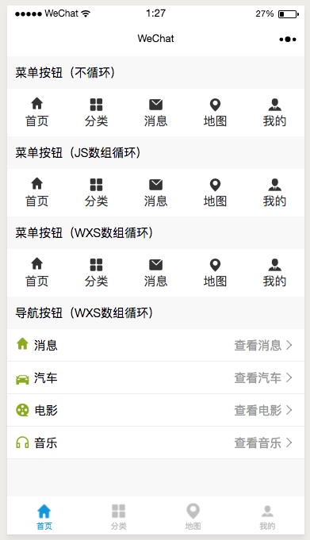

# END

网上现在很多类似的教程，但是群里的朋友经常问，所以抽个时间写了一篇简陋的教程。本人小学文化文笔有限，能理解的就理解，不能理解的拉J8倒。本来还想多写几个常见的demo，但是电脑没电要关机了，所以就到这儿吧，另外有问题加QQ问我，我懂得都会尽量帮你。
Email：  764793764@qq.com
QQGroup：481612621


